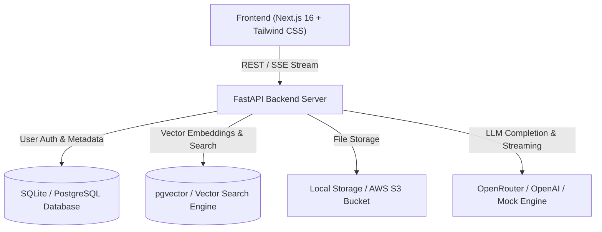

# 🏢 KnowledgeAI - Enterprise AI Knowledge Assistant
### Production-Grade Retrieval-Augmented Generation (RAG) Platform

KnowledgeAI is an enterprise-grade, multi-tenant AI Knowledge Assistant designed to help organizations query, summarize, and extract verified answers and citations from internal policies, contracts, technical specifications, and documents.

---

## 🎯 Key Benefits & Value Proposition

| Benefit | How It Works in KnowledgeAI |
|---|---|
| **🔒 Zero Hallucination Guarantee** | Answers are strictly grounded in your uploaded documents. If a detail is missing, the AI states so instead of inventing false facts. |
| **📑 Verified Source Citations** | Every answer provides exact source links and page numbers (e.g. `[1] handbook.pdf p.2`) so answers can be audited. |
| **🛡️ Multi-Tenant Security & Isolation** | Each user/organization only retrieves and interacts with their own uploaded files. Cross-tenant data leakage is prevented at the database level. |
| **⚡ Hybrid Retrieval (Semantic + Lexical)** | Combines Dense Vector Search with Keyword Matching and Reciprocal Rank Fusion (RRF) for high recall accuracy. |
| **📊 Real-time Observability & Evaluation** | Built-in analytics tracking retrieval latency, LLM latency, token counts, cost estimations, and RAG evaluation scores (Faithfulness, Recall, Relevance). |
| **📁 Multi-Format Ingestion** | Full support for `.pdf`, `.docx`, `.txt`, and `.md` files with automatic chunking and embedding. |

---

## 🚀 Step-by-Step Guide: How to Use KnowledgeAI

### 1. Account Setup & Authentication
1. Open the application at **`http://localhost:3000`** (or your production Vercel URL).
2. Click **Create an account** (`/register`) and enter your email and password.
3. Once logged in, your secure JWT session is established and your private workspace is created.

---

### 2. Uploading & Managing Documents (`/documents`)
1. Navigate to the **Documents** tab in the sidebar.
2. Drag & drop or browse for your file (e.g., `enterprise_demo_knowledge_base.pdf`, company manuals, HR policies, technical handbooks).
3. The platform automatically:
   - Extracts raw text and detects page counts.
   - Splits content into intelligent chunk segments with semantic overlap.
   - Generates high-dimensional vector embeddings.
   - Saves chunks with tenant ownership tags.
4. When the badge changes to **`COMPLETED`**, your document is ready for instant querying.
5. **Deleting Documents**: If you delete a document, all associated vector chunks and files are immediately wiped from the database.

---

### 3. Asking Questions & Summarizing (`/chat`)
1. Navigate to **Chat Assistant** in the sidebar.
2. Type **"hey"** or **"hello"** to start a natural conversation.
3. Ask specific questions about your uploaded documents:
   - *"What is the annual leave and sick leave policy?"*
   - *"What are the domestic travel per diem limits?"*
   - *"How much budget do we get for home office setup?"*
   - *"Give me a full summary of the document."*
4. The assistant streams back answers in real-time, displaying:
   - Direct answers with inline citation badges `[1]`, `[2]`.
   - The interactive **Sources Drawer** at the bottom showing exact file names and page numbers.
   - Upvote / Downvote buttons for user feedback collection.

---

### 4. Monitoring Platform Health & Metrics (`/dashboard`)
1. Go to **Dashboard** to see your enterprise analytics:
   - Total documents indexed & total chunks.
   - Average query latency (retrieval vs LLM generation).
   - Approximate token usage and cost per query.
   - User satisfaction ratings based on feedback thumbs.

---

### 5. Automated RAG Pipeline Evaluation (`/evaluation`)
1. Go to **RAG Evaluation** to run automated benchmark tests on your retrieval pipeline.
2. Measures 4 core industry benchmarks:
   - **Faithfulness**: Is the answer 100% grounded in retrieved context?
   - **Answer Relevance**: Does the answer directly address the user's intent?
   - **Context Recall**: Were all required facts retrieved in top candidates?
   - **Citation Accuracy**: Are sources linked correctly?

---

## 🛠️ Architecture & Tech Stack

- **Frontend**: Next.js (App Router), TypeScript, Tailwind CSS, Lucide Icons.
- **Backend API**: FastAPI (Python 3.11), SQLAlchemy ORM, Pydantic V2.
- **Vector Storage**: pgvector on PostgreSQL (with SQLite fallback for local testing).
- **LLM Integrations**: OpenRouter, OpenAI (`gpt-4o-mini`), Groq, or Mock offline mode.
