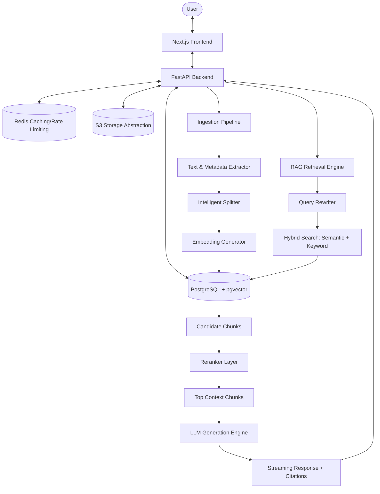

# Enterprise AI Knowledge Assistant

A production-grade Enterprise AI Knowledge Assistant built with a Next.js frontend, a FastAPI backend, PostgreSQL + `pgvector` for vector storage, Redis for caching/rate-limiting, and modular AI/RAG layers supporting hybrid retrieval, reranking, cost-tracking, and complete evaluation.

---

## 🏗️ Architecture



---

## 🛠️ Tech Stack

- **Frontend**: Next.js, React, TypeScript, Tailwind CSS, shadcn/ui, Framer Motion
- **Backend**: FastAPI, Python 3.11+, SQLAlchemy 2.0, Pydantic v2
- **Vector Database**: PostgreSQL with the `pgvector` extension
- **Caching & Rate Limiting**: Redis
- **Storage**: AWS S3 or MinIO (compatible storage abstraction)
- **AI Integrations**: OpenAI / Cohere / Custom Mock APIs for Local Testing
- **Testing**: pytest (backend), Jest/React Testing Library (frontend)
- **Deployment**: Docker, Docker Compose, GitHub Actions

---

## 📂 Project Structure

```text
enterprise-ai-assistant/
│
├── frontend/             # Next.js Frontend Application
│   ├── app/              # Page routes & layout
│   ├── components/       # UI Components
│   ├── hooks/            # Custom React Hooks
│   ├── lib/              # Client utilities
│   ├── types/            # TypeScript type definitions
│   └── public/           # Static assets
│
├── backend/              # FastAPI Backend Application
│   ├── app/
│   │   ├── api/          # API Route Controllers
│   │   ├── core/         # Settings, security, database sessions
│   │   ├── models/       # SQLAlchemy models
│   │   ├── schemas/      # Pydantic validation schemas
│   │   ├── services/     # Business logic layers (Auth, S3, etc.)
│   │   ├── ai/           # LLM & Embedding provider implementations
│   │   ├── rag/          # Hybrid search, query rewriting, reranking
│   │   ├── ingestion/    # Document parsing and chunking
│   │   ├── evaluation/   # RAG metrics framework
│   │   └── main.py       # FastAPI Entrypoint
│   └── tests/            # Pytest suite
│
├── docker/               # Docker configuration files
├── scripts/              # Setup, seed, and migration scripts
├── docs/                 # Detailed architecture documentation
├── .env.example          # Template environment variables
├── docker-compose.yml    # Development Docker Compose file
└── README.md             # Project documentation
```

---

## 🚀 Quick Start (Local Setup)

More instructions will be added as stages are completed.

### 1. Prerequisites
- Python 3.11+
- Node.js 18+ & npm/yarn
- Docker & Docker Compose
- PostgreSQL + pgvector (or run via Docker)

### 2. Initial Setup
1. Clone the repository.
2. Copy `.env.example` to `.env` and fill in the required API keys and settings:
   ```bash
   cp .env.example .env
   ```

### 3. Backend Setup
```bash
cd backend
python -m venv .venv
source .venv/bin/activate  # Or `.venv\Scripts\activate` on Windows
pip install -r requirements.txt
uvicorn app.main:app --reload
```

### 4. Frontend Setup
```bash
cd frontend
npm install
npm run dev
```
